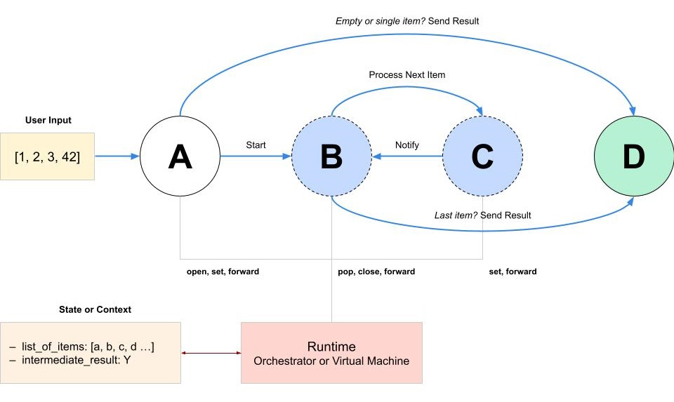
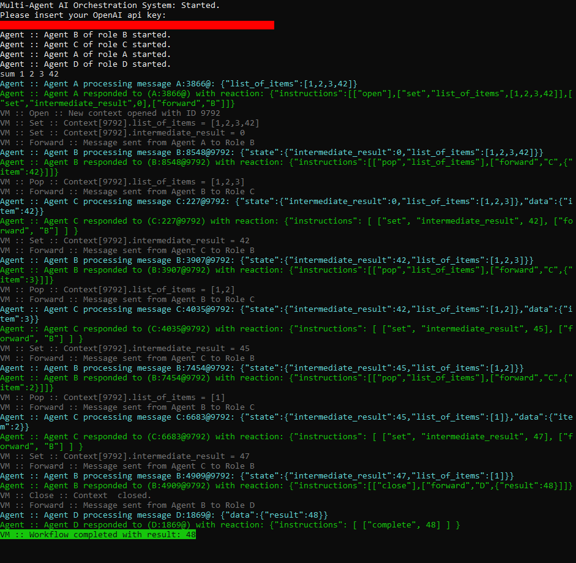

# Multi-Agent AI Orchestration

This document is available in [English](readme.en.md) and [Italian](readme.it.md) languages. 

Please note that the English version was largely translated with the help of an AI.

## The most expensive way to sum a list of numbers

In this repository, I present a small piece of software developed during my sabbatical, during which I decided to experiment with the possibilities offered by AI in a practical way, by building a demonstrative prototype.

The project consists of an **organizational model based on AI agents that cooperates together** to achieve a common goal, implemented in C# .NET language through a working prototype.

This architecture is not new - similar systems (like [Microsoft AutoGen](https://microsoft.github.io/autogen/)) already exist, both consolidated or under development. Here I propose a simple, from-scratch implementation of the basic principles that are presumably going to constitute the next generation of software engineering.

The proposed model is a **conceptual experiment** that could provide a preview of how the companies of the future will be structured: groups of AI agents specialized and trained for specific tasks, communicating with each other asynchronously and sharing information in a secured manner, transforming data and performing actions. Significantly reducing or even eliminating the need to involve humans inside business processes (I've included a [personal comment](#comment) on the subject at the end of this document).

The source code is freely viewable and usable, published in this GitHub repository and released under the MIT license. For further information on the topic, please refer to [Agent-Oriented Programming](https://en.wikipedia.org/wiki/Agent-oriented_programming) and [Actor Model](https://en.wikipedia.org/wiki/Actor_model).

## Premises

Inspired by the recent developments in the field of artificial intelligence, I tried to imagine how the companies of the future will function, and how AI could transform today's companies to project them into the future.

In an abstract sense, every company is an **organization**. Every organization is composed of more or less sentient entities. We call these entities **agents**. Organizations of the future will be composed of agents of 3 types: human agents, AI agents, and *hard-coded* agents, in cost order.

- **Human agents** (1) will be very intelligent, but expensive and inefficient. They will be involved in business processes only to supervise, validate, and accept the results proposed by AIs.
- **AI agents** (2) will be less intelligent than humans but more competent, flexible, and less expensive. They will be used for all those tasks where a minimum level of intelligence is sufficient to replace a human operator acceptably, according to cost and results optimization criteria.
- **Hard-coded agents** (3) will be the least expensive and most efficient, and absolutely stupid. They are the current *programs*. They will be used to perform all those perfectly algorithmic tasks for which it's not necessary to possess a minimum level of non-mechanical intelligence.

In today's organizations, type 1 and 3 agents dominate.

Programs perform those predetermined and repetitive tasks that require exact procedures and well-defined input / output. Humans do everything else: solving problems under non-predetermined and uncertain conditions, manipulation of unstructured data, team cooperation, creation of reusable procedures and solutions, and so on.

The organizations of the future will see the insertion of type 2 agents as an intermediate figure: not too intelligent, not too stupid, not too expensive, efficient *enough*. In practice, the perfect worker. AIs will dominate the organizations of the future.

## The Experiment

One of the practical applications where ChatGPT has immediately been a hit among users is in the simulation of **role-playing games**.

The AI is asked to impersonate someone or something and, with maximum availability and without signs of protest, it imitates the proposed subject by mimicking its language and behavior. With this approach, which finds its highest expression in the so-called *prompt engineering*, it is possible to turn ChatGPT into a professional at our pleasure and full disposal. Writer, translator, software developer, artist or illustrator, financial analyst, or CEO of a company - there is no limit to the type of character, or **role**, to make it play. 

Let's imagine creating our organization made up of AI agents who all play, together but in different roles, the same game. We give each agent a **script** to follow, specifying the rules of the game.

    We are playing a role-playing game. 
    Here are the general rules of role-playing games:

    - There are organizations.
    - An organization has one or more agents.
    - An agent of an organization has a role, and can only have one role.
    - An organization can have multiple agents with the same role.
    - Agents of an organization cooperate to reach a common goal.
	  They work in parallel by exchanging information asynchronously using message queues.
    - Each role has a message queue that contains input messages for agents of that role.
    - An agent can send messages to other agents writing to the proper message queue.
    - An orchestrator decides which messages to dequeue and assign to agents.
    - Messages can be grouped into jobs, which represent a distributed unit of work.

The text just shown contains the **meta-rules** of the game. These rules instruct all agents on the execution context of a generic game. 

Those rules specify that our organization is composed of agents who exchange messages asynchronously via a [queue system](https://en.wikipedia.org/wiki/Message_queue). They also specify that each agent impersonates a specific role, and that communication between agents is mediated by an **orchestrator** - a runtime system that routes messages and supervises access to resources in a way similar to what an operating system would do.

Now let's get to the heart of the experiment. Suppose that the goal of our organization is to sum lists of numbers received as input from the user, and let's extend our script with more concrete rules.

    Our game is called "The most expensive way to sum a list of numbers".
    Here are the game rules:

    - You are an agent working for the organization NaiveSummers.
    - The goal of the organization NaiveSummers is to sum a list of numbers.
    - Agents of NaiveSummers are organized into the following roles:
	    - Role A: an agent that starts the operations.
	    - Role B: an agent that receives a list of numbers to sum and forwards each single numbers to sum.
	    - Role C: an agent that receives a single number to sum and sums it with the intermediate result, starting from 0.
	    - Role D: an agent that receives final result and signals the completion of the operation.

    For example, we call Agent X an agent of role X.
    - Agent A starts the operations by sending a list of numbers to Agent B.
    - Agent B forwards each number to Agent C. When all numbers are processed, Agent B sends the final result to Agent D and closes the operations.
    - Agent C sums the current number with the intermediate result and notifies back to Agent B when an intermediate sum is done.
    - Agent D signals the completion of the operation, showing the final result.

The piece of text shown above is the **prologue** of our script. This section specifies the actual game rules: the name of the organization, the goal to be achieved, the roles to be impersonated and the respective actions to be performed to correctly play their part. The prologue is shared with all participating agents and represents an overview of the operations.

To sum a list of numbers, our organization is composed of 4 roles. Each role has a specific function within the workflow. In our experiment, we will have 4 agents impersonating 4 roles.

Imagine a role as an entity associated with a message queue. There can be multiple agents for each role, but an agent has one and only one role. In our environment, vaguely described by the meta-rules, an agent is an instance of a role and represents a unit of workforce with its own internal memory (just like an instance of a conversation with an LLM).

From a strictly technical point of view, an agent is similar to a *thread*, an asynchronous processing unit that communicates with its peers by reading and writing messages in the appropriate queues. A role, therefore, specifies the type of behavior that a worker must manifest.

The roles and the **workflow** of our experiment are more effectively described by the following diagram.

Suppose that our AI agents do not have a good short-term memory, or that their memory is unreliable and subject to errors, much like it happens for humans. 

Agents will need to access a shared memory to store and retrieve the data of ongoing operations. We call **state** this memory. Access to the state will be mediated by the runtime - the orchestrator, in the form of a virtual machine - which will be responsible for controlling data access and providing the communication primitives between agents to realize the exchange of messages.

Let's look at the cooperative workflow in detail:

- **Role A**. Agent A receives as input a list of numbers to add. If the list is empty, agent A forwards the result (zero) to agent D. If the list contains only one element, agent A forwards that element to agent D as the final result. If the list contains more than one number, agent A opens a shared state and initializes it, storing the list of numbers and the intermediate result (zero), then invokes agent B by sending a message to it.

- **Role B**. Agent B receives a message from A to start the sum operations. If the list contains at least one number, agent B removes the last number from the list (*pop*) and forwards it to agent C, updating the state. Otherwise, if the list is empty, agent B forwards the intermediate result to agent D and closes the state. 

- **Role C**. Agent C receives as input a number to add. Agent C adds the received number to the intermediate result, updating the state, then notifies agent B of the operation's completion.

- **Role D**. Agent D receives as input the final result and signals the completion of the operations to the user.

Our agents will accept input and return output messages exclusively in **JSON format**. An agent's input will be a message coming from another agent and equipped with the context, that is, the memory containing the state of operations. An agent's output will not be used, trivially, as the input to forward to the next agent, but it will be a structure containing a series of **instructions** that the runtime will interpret and execute to continue the workflow. These instructions refer to primitives for control flow and data manipulation (as happens in any abstract machine).

To perform its task correctly, each role has a specific **role script** that describes in detail the behavior to follow. We'll show the specific scripts for each role in the next section. For now, we close this section by showing the **epilogue** - the final section of our script.

	You'll begin to receive some input messages to process. 
    Please wait for the first message. When responding to messages, you must not write anything 
    other JSON code in the format described above.
    Good game!

## Roles Specification

Now let's look at the specific scripts for each role. These scripts, unlike the prologue, are very detailed and resemble the structure of a pseudo-code, even though they are written in natural language.

### Role A

    You are an agent of Role A.

    As a role A agent, you will be provided with an input message in JSON format.
    The input message has the following structure:

	    { "list_of_items": LIST_OF_ITEMS }

    Where LIST_OF_ITEMS is a list of numbers.

    Let LAST_ITEM be the last item of LIST_OF_ITEMS (if LIST_OF_ITEMS is not empty).
    If and only if LIST_OF_ITEMS is empty, you must respond with a JSON message with the following structure:

	    { "instructions": [ ["forward", "D", { "result": 0 }] ] }

    Otherwise, if and only if LIST_OF_ITEMS has only one item, you must respond with a JSON message with the following structure:

	    { "instructions": [ ["forward", "D", { "result": LAST_ITEM }] ] }

    Otherwise, if and only if LIST_OF_ITEMS has more than one item, you must respond with a JSON message with the following structure:
	
	    { "instructions": [ ["open"], ["set", "list_of_items", LIST_OF_ITEMS], ["set", "intermediate_result", 0], ["forward", "B"] ] }

### Role B

    You are an agent of Role B.

    As a role B agent, you will be provided with an input message in JSON format.
    The input message has the following structure:

	    { "state": { "list_of_items": LIST_OF_ITEMS, "intermediate_result": INTERMEDIATE_RESULT } }

    Where LIST_OF_ITEMS is a list of numbers, and INTERMEDIATE_RESULT is a number.
    Other fields may be present inside the "state" object, but they are not relevant for this task and you must ignore them.

    Let LAST_ITEM be the last item of LIST_OF_ITEMS (if LIST_OF_ITEMS is not empty).

    If and only if LIST_OF_ITEMS is empty, you must respond with a JSON message with the following structure:

	    { "instructions": [ ["close"], ["forward", "D", { "result": INTERMEDIATE_RESULT }] ] }

    Otherwise, if and only if LIST_OF_ITEMS is not empty, you must respond with a JSON message with the following structure:
	
	    { "instructions": [ ["pop", "list_of_items"], ["forward", "C", { "item": LAST_ITEM }] ] }

### Role C

    You are an agent of Role C.

    As a role C agent, you will be provided with an input message in JSON format.
    The input message has the following structure:

	    { "state": { "intermediate_result": INTERMEDIATE_RESULT }, "data": { "item": CURRENT_ITEM } } }

    Where INTERMEDIATE_RESULT is a number and CURENT_ITEM is a number.
    Other fields may be present inside the "state" object, but they are not relevant for this task and you must ignore them.

    Your task is to sum the intermediate result with the current item.
    Let SUM be the result of the sum operation.

    You must respond with a JSON message with the following structure:

	    { "instructions": [ ["set", "intermediate_result", SUM], ["forward", "B"] ] }

### Role D

    You are an agent of Role D.

    As a role D agent, you will be provided with an input message in JSON format.
    The input message has the following structure:

	    { "data": { "result": RESULT } }

    Where RESULT is a number.

    Your task is to signal the completion of the sum workflow.

    You must respond with a JSON message with the following structure:

	    { "instructions": [ ["complete", RESULT] ] }

### Equivalent Function

The scripts proposed above do nothing more than realize, following an asynchronous paradigm based on message exchange, the following pseudo-code.

    agent A(input) => 
        if (input.length == 0)
            forward 0 to D
        else if (input.length == 1) 
            forward input.first to D
	    else
            state.open()
            state.set("list_of_items", input)
            state.set("intermediate_result", 0)
            forward to B

    agent B => 
	    if (state.get("list_of_items").length == 0)
            intermediate_result = state.get("intermediate_result")
            state.close()
            forward intermediate_result to D
	    else
            list_of_items = state.get("list_of_items")
            last_item = list_of_items.pop()
            forward last_item to C

    agent C(current_item) =>
        intermediate_result = state.get("intermediate_result")
	    sum = intermediate_result + current_item
	    state.set("intermediate_result", sum)
	    forward to B

    agent D(result) =>
	    print(result)

    # Start Workflow
    Sum([1, 2, 3, 42])

Which is nothing more than an asynchronous, distributed, and very complicated way to realize, more or less, the following function expressed in pseudo-code.

    list_of_items = [1, 2, 3, 42]
    intermediate_result = 0

    function Sum(input) =>
        if (input.length == 0)                                  # Agent A
            print 0                                             # Agent D
        else if (input.length == 1)                             # Agent A
            print input.first                                   # Agent D
	    else
            list_of_items = input                               # Agent A
            intermediate_result = 0                             # Agent A
            do
                var current_item = list_of_items.pop()          # Agent B
                var sum = intermediate_result + current_item    # Agent C
                intermediate_result = sum                       # Agent C
            while (list.length > 0)                             # Agent B
            print intermediate_result                           # Agent D

    # Start Workflow
    Sum([1, 2, 3, 42])

## The Implementation

After designing the conceptual experiment and specifying the game rules in the form of scripts, I proceeded with the actual implementation of the prototype. It's not worth delving into the details of the source code, which overall has a simple and unpretentious structure. In this section, I will just provide a high-level overview of the implemented features and the development process.

The `Architecture` folder within the solution contains the main classes. `Agent`, `Message`, `Role`, and `Script` need no further explanation. The other important classes are:
- `Process` which represents the execution context of a workflow,
- `Queue` which implements an asynchronous message queue,
- `Reaction` which represents an agent's output in the form of a list of instructions,
- `Machine` which implements a VM for executing the instructions produced by the agents.

The `Machine` class implements, in particular, the essential primitives to correctly realize the workflow proposed in this experiment:
- `open` to open a new state,
- `close` to close a state,
- `set` to insert or overwrite a value in the state,
- `pop` to remove the last element from a list stored in the state,
- `forward` to forward a message to an agent.

In an initial phase, the 4 roles were implemented in a hard-coded way, writing specific procedures that use the `Newtonsoft.JSON` library to parse messages. These procedures can be found within the `MockLambdas` class.

After verifying the correctness of the *mock* implementation, the roles were finally implemented through AI, using OpenAI's APIs and the `Azure.AI.OpenAI` library as a client. The LLM model used is `gpt-3.5-turbo` with the JSON-mode option enabled and the `temperature` parameter left at its default value. The scripts of each agent were passed via API as *System Messages* within a conversation.

The various sections of the script (meta-rules, prologue, epilogue, role script) can be found within the `.data` folder, and the solution can be tested by starting the program and sending the string `sum 1 2 3 42` to the terminal.

I invite the reader to clone the repository and follow the execution step-by-step, starting from the `Program.cs` file, to better understand the logic behind the proposed implementation.

## The Result

The implementation powered by AI agents **worked** after a few attempts, without the need for major corrections to the scripts or to configure the parameters of the underlying LLM model - for example, by setting a `temperature` close to zero. Subsequently, I conducted other tests with lower `temperature` values and refined the scripts to obtain cleaner outputs from a purely syntactic point of view, further verifying the correctness of the implementation.

Below is a sample screenshot showing the output produced by the system for the input `[1, 2, 3, 42]`.

In light of the results obtained, the following considerations emerge, some trivial, others less:

1. Our agents implemented through OpenAI prove to be formidable parsers and producers of correct JSON code,

2. Our agents are perfectly capable of understanding the concepts of *list* (empty or not) and *last element*, as well as identifying the last element within a list in JSON format,

3. Our agents are able to output the result of simple mathematical operations like sums of integers of a few digits, leaving aside for now the possibility of extending the models provided by OpenAI with programmed functions,

4. Our agents are able to **select** an appropriate type of response based on the provided context, i.e. they are capable of performing simple selection actions (*if-then-else*),

5. Considering the *forward* primitive provided by the virtual machine implemented for this experiment, our agents are capable of performing **turing-complete** computations, given that the underlying LLM does not make mistakes in providing the result of arithmetic calculations, and does not manifest other errors related to text understanding or limited contextual memory. The *forward* primitive indeed allows to express recursive calls between agents within the same working context.

It's important to note how, within the role scripts shown earlier, our agents **have not** been instructed on the *instruction set* provided by the runtime. 

They have never received an exact and complete specification of the usable primitives. They simply analyze, for now, the shape of the input and respond with a syntactic structure that seems most suitable to them based on the received directives, appropriately replacing the *placeholders* that represent parameters - intuiting quite intelligently which are the placeholders within the JSONs shown in their respective scripts, and identifying the corresponding values in subsequent inputs of the same shape.

In the future, it could be possible to design agents that, given a specific *instruction set* as input, autonomously use the runtime primitives to achieve the desired results (see next section, point 5).

To perform the OpenAI calls required to complete the experiment in all its parts, I ironically spent **$0.02**. At this point, I can say that I have given my *two-cents* to the AI sector and discovered the most expensive way to sum a list of numbers.

## Predictions for the Future

Regarding the experiment, I believe that the process and the material produced so far are stimulating enough to deserve further development in a dedicated project, whether open source or market-oriented. As for the future of work, please refer to the next section containing a [personal opinion](#comment).

I will summarize here the evaluations that seem to me more objective, and the most likely predictions for the future of software engineering.

1. As this trivial experiment demonstrates, it is already possible to create AI agents that collaborate with each other to perform tasks that are more or less complex - partly algorithmic, partly intelligent - by sharing information and coordinating to solve problems.

2. The complexity of the workflows in which AI will be involved is already increasing. Agents will not be limited to sum lists of numbers but will perform complex operations such as reading, writing, and exchanging documents, querying business databases, reading files on disk, making API calls to act tangibly on the external world, and so on.

3. Consequently, in the not-so-distant future, AI will be able not only to work on context-limited tasks (producing a text, translating a text) but also to aggregate and analyze **scattered information** to navigate through complex, cross-functional environments and embody equally complex roles (drafting a company budget from accounting documents, autonomously creating and posting content on corporate social channels, publishing a job posting on LinkedIn and automatically scheduling a video call with the best candidate, and so on ad infinitum).

4. If a computer system becomes, trivially and essentially, a textual specification, realizing the ultimate dream of requirements analysis to transform a piece of natural language text into a functioning system, then all computer systems will be **self-programmable**. There will be an AI agent specialized in producing a system specification (something similar to the script shown in this experiment) aimed at simulating the operations of a company or one of its branches. The near future could be made up of **agents that generate organizations of agents** to solve business problems.

5. This vision, which may seem futuristic, could actually be already outdated. We have *assumed* that agents need a very detailed set of rules, generated by an intelligent actor, to solve a concrete problem. There is nothing theoretically preventing a group of agents, appropriately instructed with effective enough meta-rules, from being so intelligent as to be able to **self-organize**. In other words, given the formulation of a problem as input, to find a formal solution to the problem, and then to communicate and cooperate internally to self-assign roles and tasks, without needing any further instruction except for the problem specification to be solved and the execution environment - autonomously inferring both the abstract solution and the concrete implementation. The future could be made up of **self-determined societies of agents**.

6. We are moving towards a computing dominated by **AIOps**, and a technical-economic paradigm of **Organization-as-a-Service**. We'll be able to purchase virtual organizations composed of virtual individuals, generating our professionals with capacity and skills to our liking. We'll be able to assemble our companies as if they were customized Lego bricks, dynamically transformable, scalable, and supervised by human beings in-the-middle, with the only constraint of economic and energetic cost. By merging the words *agent* and *organization*, we could say that the near future will be the era of **agentization**.

## The Future of Intellectual Work

**Warning**. This section contains personal opinions without any claim to objectivity.

AI systems like ChatGPT were initially conceived as *chatbots*, conversational agents oriented towards dialogue and interaction with a human being. They are often presented to the general public as *copilots*: virtual assistants that help users perform tasks, more or less complex, under their command.

More often than not, AI is praised by technology enthusiasts with the claim that they are simply tools. Not a threat to workers, but just an instrument to speed up or automate part of the work, freeing human operators from the burden of tedious and repetitive tasks.

The dominant narrative on the subject is clear and decidedly positivist. AI will make us more efficient and productive; those who manage to incorporate it into their skill set will continue to have a place in the job market, those who fail to adapt will succumb (hurray for the free market, etc.).

This view is partly true, but I believe it is enormously reductive and fails to fully grasp the impact that AI will have on the labour market, particularly in the realm of intellectual work and services, greatly underestimating the risks in favor of the benefits.

I am always surprised when reading articles, opinions, and comments online to see that the most enthusiastic advocates of AI are precisely the workers in the technology sector, especially developers. I consider this as a general indicator of the level of computer literacy, even among those who practice computing professionally.

The invention of generative AI is the beginning of an industrial revolution. With the previous industrial revolution, the digital one, the (dumb) automation of machines replaced workers on factory assembly lines.

The fourth industrial revolution, the one currently underway and already based on the advent of the cloud and pervasive internet, will see the automation (this time less dumb) of machines replacing workers in the assembly lines of informational services, that is, inside the intellectual processes of analysis, design, and decision-making concerning everything that is not material. It will not only affect the *doing* but also the *knowing* and the *understanding*.

The shock wave will affect all professional figures that exist solely due to their purely intellectual, non-manual activity, detached from physical reality. This includes all workers in digital, communication, and information fields, services and bureaucracy, as well as consultants and those historically considered custodians of knowledge and specific expertise: lawyers, engineers, managers, perhaps even physicians.

Contrary to the prevailing opinion on the subject, I have the feeling that this change will not create more jobs than it will destroy, but instead will cause quite a few problems to many people.

The reason is the following: the speed at which AI will infiltrate business and economic processes (a bunch of years) will not give most affected workers the time to metabolize the change and reconvert into some new and unlikely professional figure, for which there may not even be a need anymore.

This line of reasoning inevitably leads to political and social reflections that are not into the scope of this comment.

The purpose of this comment is instead an invitation to **prepare**, without wanting to exaggerate but also not to underestimate the risks, particularly aimed at those who are considering starting a career in the field of computer science to make a living - as a front-end developer, full-stack developer, back-end developer, data analyst, and so on - as the industry will be profoundly overturned by the AI revolution.

## Contacts

If you would like to contact me for any question or further information, you can email me at (info [at] federicocorrao [dot] it). I will be happy to answer!
